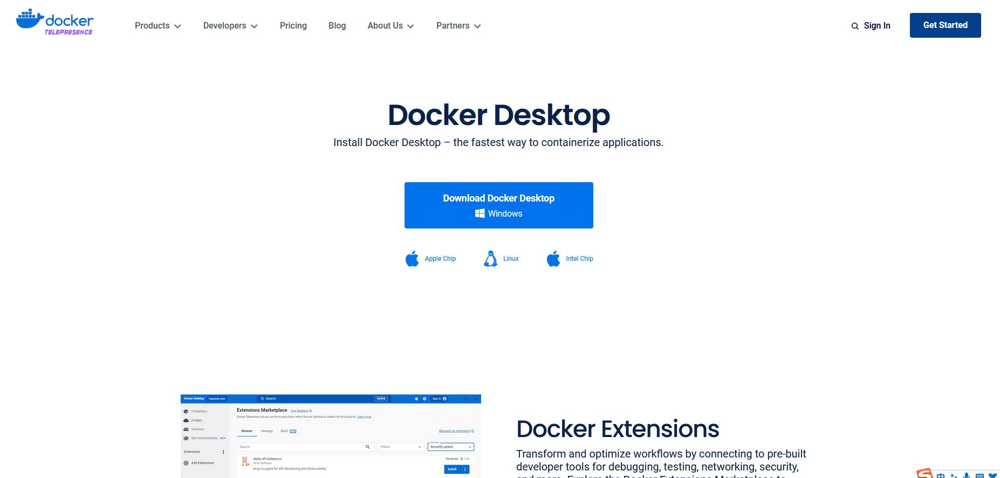
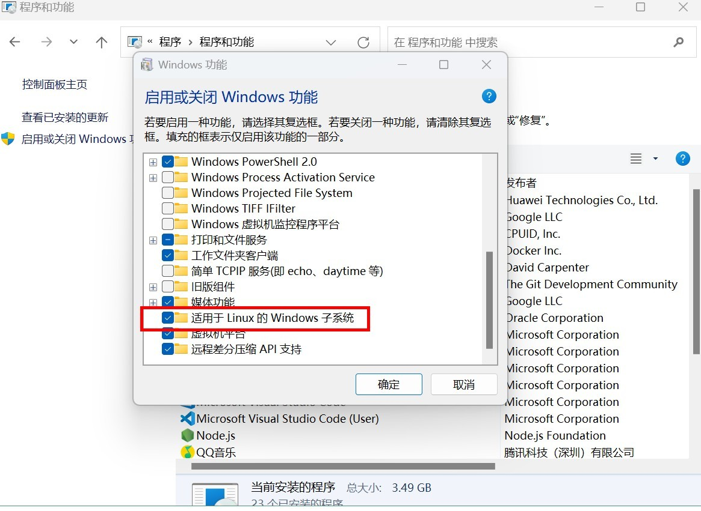
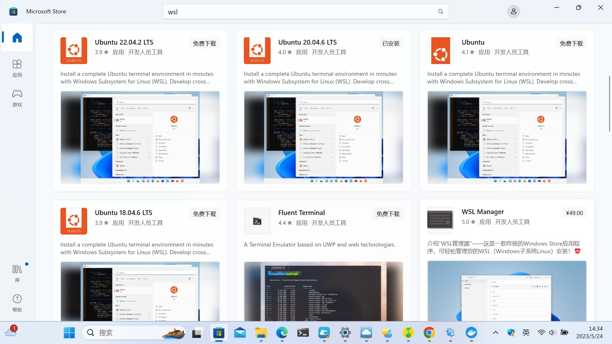

## 学习docker，以及利用docker搭建常用的开发环境的日常笔记

### 一、**docker**
* [docker官网](https://www.docker.com)： _https://www.docker.com_
* [docker官网](https://docs.docker.com/)： _https://docs.docker.com_
* [docker hub镜像官网](https://hub.docker.com/)： _https://hub.docker.com/_

**注意**
1、由于docker hub官网在国内时不时会被禁止访问，可能会用到的第三方的网站

* [建木hub镜像官网](https://jianmuhub.com/)： _https://jianmuhub.com/_
---

### 学习笔记

#### 1、安装docker（只涉及到win10+）
##### 1.1、方法一：Window系统直接下载Docker Desktop

1、下载安装工具

2、安装后打开工具

---
##### 1.2、方法一：Window系统安装虚拟机、Docker Engine（docker引擎）

一、启用虚拟机WSL

wsl 是 windows subsystem for Linux 的简称，就是微软开发的一款在Windows中使用的Linux系统，和Windows可以互通，具有Linux系统的绝大部分功能。

1> 启用子系统Linux功能
到“控制面板”——“卸载程序”——“启用或关闭Windows功能中”，启用“适用于Linux的windows子系统”

然后点击“确定”，接着重启

2> 查看WSL版本
使用wsl -l -v 来查看wsl版本（如果是1的话，请将版本改成2）

3> 通过win系统的Microsoft Store安装Linux子系统（常用ubuntu）

二、在虚拟机中的ubuntu linux系统中安装Docker Engine
